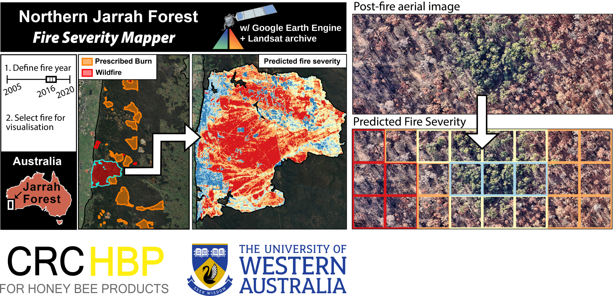

# njf-fire-sev

This repository is associated with the paper "Regional-scale fire severity mapping of *Eucalyptus* forests with the Landsat archive" in the journal *Remote Sensing of Environment* from 2022. Here, you'll find access to the following: 

