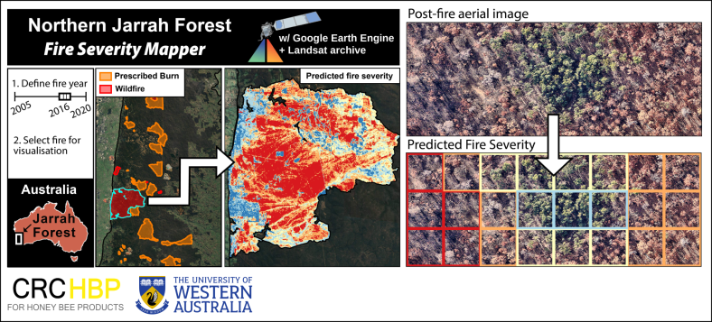

Last updated: 01.2022 

Overview
--------

This repository is associated with the [open access paper](https://www.google.com "Google's Homepage")
 "Regional-scale fire severity mapping of *Eucalyptus* forests with the Landsat archive" in the journal *Remote Sensing of Environment* by Dan J. Dixon, J. Nikolaus Callow, John M.A. Duncan, Samantha A. Setterfield, and Natasha Paul (2022). 

  

Visualise fire severity
--------
A Google Earth Engine application to visualise predicted fire severity on prescribed burns and wildfires from 2005 to 2020 in the Northern Jarrah Forest (link)

Here have a gif the same size as the window above showing how to use the ee mapping tool

Data
--------
  - Download predicted fire severity rasters for each fire at 30 x 30 m resolution
  - Shapefile to associate each predicted raster and burn perimeter
  - Tables containing the following:
    - Train/test fire info -> predictors and response variable for training random forest (CSV)
    - Dates-of-fire obtained from MODIS (CSV)
 
Analyse
--------
   -  Accessing fire data through Earth Engine image collection + explore, plot and map a fire (access_fire_ee.ipynb)
   -  Quantify the area of each fire severity class by fire type over time (quantify_area.ipynb)

Coming soon
--------
   -  Apply the model to your own fire polygon + export to QGIS

Cite
--------
Link

Questions
--------
Dan J. Dixon

Email: danieldixon@research.uwa.edu.au  
Cooperative Research Centre for Honeybee Products: https://www.crchoneybeeproducts.com/
